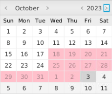

# Release 2
In this release, we have changed the project to a multi-module setup.

## Changes and features:
- Converted from single module to multi-module
- Moved logic from controller to core in accordance with the principles of a 3-layer architecture
- Updated to JUnit 5
- Changed from using simple json to Jackson for file storage
- Calendar now shows which dates the currently selected item is booked. 

- Test coverage has been increased significantly and covers all modules. 
- Read/write functionality has been changed completely and now stores entire calendar, booking and item objects which means all necessary information is now stored. 
- Changed from using simple Json to Jackson for file storage which allows for more customization especially when it comes to storing objects with references to each other.

# Architecture and workflow

Above is a class diagram showing the relations between the main classes of the project. The Calendar class can contain many bookings which again contains one Item and one User. Users do not actually contain any bookings as that is handled by the Calendar class.

## Workflow
We've strived to follow the principles of pair-programming during release 2. This principle requires one person to be the driver, who writes code, and the other to be the observer who reviews the code and gives input to the driver whilst typing. Ideally we would have liked to switch up the pairs during the release, but unfortunately the time schedules of the group members made this difficult. Therefore Robin and Vebjørn paired up while Ola and Tor Jacob were the other pair. We made sure to switch driver/observer role frequently.

Pair-programming allowed us to share knowledge and skills, but it also slowed down our development time as in release 1 we tried to split the workload so that all 4 could work at the same time and then merge our branches, but in release 2 our max capacity was limited by this. Overall we found pair-programming to be beneficial as we got more insight into what had until now been others' part of the project and we also made fewer mistakes, but we definitely worked faster when we worked more individually.

We have continued to meet every week on Tuesdays, just as we did in release 1, and have found that to work very well. Tuesdays is the best day for cooperation between all group members in terms of scheduling and meeting every week allows us to discuss where we are currently, what we are going to do and also help eachother with issues by working together after the meeting when we have time.

In terms of code quality we have agreed upon a standard for what objects and functions should be named as well as how they should be formatted. This has proven very useful as we don't have to guess what a method is named. For instance if someone wants to get the ID of an object, they know that function will be named getId() and not getID() or getid(). We also make sure branches that are going to be merged with master are up-to-par in terms of formatting and function by reviewing others' work.

## Saving files
We have changed the way we save files in this release. In release 1 we used a simple Json file to store all the data, but in release 2 we have changed to using Jackson to store the data. This allows us to store entire objects instead of just the data, which means we can store the entire calendar, booking and item objects. This means that we can store all the information we need to recreate the objects, which is very useful. We also store the data in a more organized way, which makes it easier to read and edit the files manually if needed.

The file format we decided to use is Json, as it is easy to read and write to. We also considered using XML, but decided against it as it is more difficult to read and write to. We have a single Json file that stores all the items, users and bookings. We have chosen to store all the data in one file as it is easier to manage when we have custom serialization and deserialization. We also considered storing the data in separate files but we would have to make sure that the files were always up-to-date.

We decided on using implicit saving instead of explicit saving. This means that the data is saved automatically when the program is closed. We decided on this as it is more user-friendly and it also makes it easier to implement. We also decided to save the data in a file called "calendar.json". 

We created serializers and deserializers for the calendar, booking and item objects. This allows us to store the objects in a more organized way and also allows us to store the objects with references to each other. For instance, the calendar object contains a list of bookings, which in turn contains an item and a user. This means that we can store the entire calendar object and all the information we need to recreate it.

