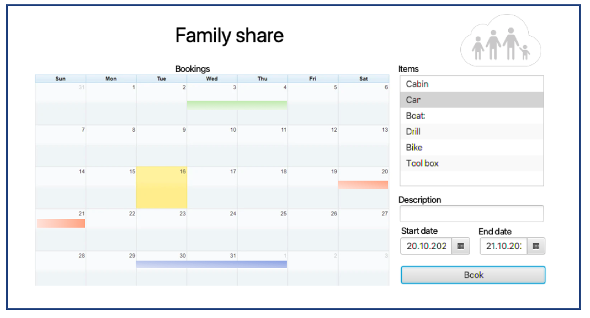

# Famshare

## Struktur og Maven build

Prosjektet er strukturert som en modulert Maven bygging. Modulene er: core som tar seg av domenelogikk og persistens. Fxui modulen håndterer brukerinteraksjon, og restapi gir en RESTful API for core modulen.

## Oppstart

Appen kan startes ved å kjøre følgende kommando i prosjektets rotmappe "famshare":

- mvn install
- mvn spring-boot:run -f restapi
- mvn javafx:run -f fxui

Teste kan kjøres ved:

- mvn test
## Brukerhistorier

For å kunne se hvilke krav applikasjonen og systemet dekker eller eventuelt ikke dekker samler vi noen brukerhistorier i denne filen.

### 1. Sommerferien skal planlegges

I storfamilien har vi en hytte og en båt på deling. Før sommerferien blir det ofte diskusjoner om både helger og ukedager da det er mange som vil benytte seg av hytta og båten. Det kan fort bli kaotisk og vanskelig å planlegge.

Et familiemedlem med en bruker skal kunne logge seg inn i dette systemet og booke tiden han/hun vil tilbringe på hytta med kjæresten. Etter innlogging vil brukeren få en oversikt over alle bookinger som er gjort på de ulike tingene familien ønsker å dele på.

Brukeren kan deretter velge hytta fra en liste over familiens gjenstander som kan bookes og fylle inn start -og sluttdato på bookingen.

### Viktig for brukeren å se

- Før og etter en booking: se en oversikt over bookinger innad i familien
- Se når hytta er ledig/opptatt
- Se en oversikt over sine bookinger

### Viktig for brukeren å gjøre

- Legge inn datoer og få tilbakemelding dersom hytta er opptatt eller dato er ugyldig
- Booke tid på hytta
- Skrive en kort beskrivelse av hvem som skal på hytta

### 2. Verktøy til oppussingen

Jeg har nettopp kjøpt en bolig av typen oppussingsobjekt. For å spare penger skal jeg og faren min gjøre mye av jobben selv. Heldigvis er onkelen min snekker og svært handy, så han har mye verktøy og redskaper han gjerne kan låne ut når han ikke trenger det selv.

Brukeren har behov for å kunne booke flere redskaper og skrive hva de skal brukes til.

### Viktig for brukeren å se

- Oversikt over alt som er lånt og når de er booket
- Både bruker som låner og låner ut: Om noen av redskapene ikke er markert som levert etter datoene som er booket

### Viktig for brukeren å gjøre

- Bruker som låner ut: kan legge inn når de ulike redskapene er ledige
- Bruker som låner: kan booke redskaper og markere redskaper som levert.

## Illustrasjon av tenkt fremtidig UI

## Diagrammer

