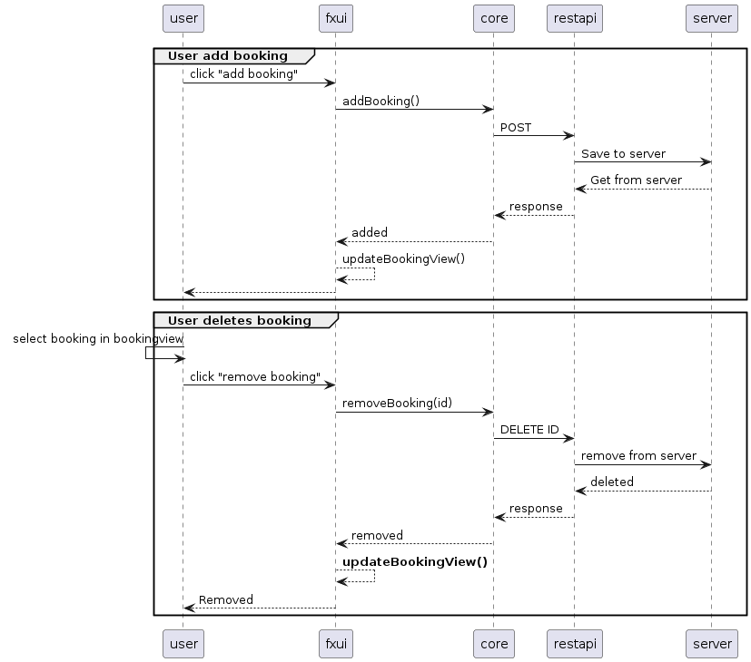

# restapi

Our restserver is a Spring Boot application, where the rest-API/mappings for HTTP-requests are defined in RestServerController.

**Restapi** contains the restserver, with the following classes:

- FamshareApplication is the main class for the restserver, it contains the main method and the @SpringBootApplication annotation.

- ApiCalendarController is the controller for the restserver, it contains the mappings for the different HTTP-requests.

- ApiCalendar is a wrapper class for the Calendar class in core, it is used to serialize/deserialize the Calendar class.

In this module you will also find files with configuration for the server under **resources**, such as which port and storage location the server should use. In addition to application.properties, which is used for all running, there is also an application-test.properties, which is used during the tests, both in this module, as well as integrationtests.

Base endpoint for the restserver is **/calendar**.

- read calendar (GET "/calendar")
- add booking to calendar (POST "/calendar")
- delete booking from calendar (DELETE "/calendar/id")
- get itemlist (GET "/calendar/itemlist")

